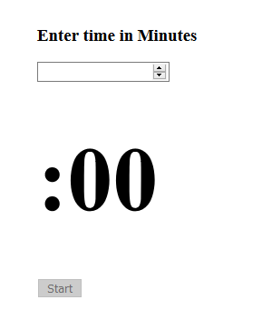

This is a CountDownClock application using React. It is implemented using React CDN links and not create-react-app for simplicity and ease of usability.

To use this repository, please do the follow the below procedure:
  1. Create a git repository by 'git init';
  2. Clone the repository by 'git clone https://github.com/akshaycb/react-countdown-clock.git';
  3. And run the countDownClock.html Page on your browser.

OR

  1. Create an HTML file on your computer, open it using any editor.
  2. Simply copy the whole countDownClock.html and paste it in the HTML file opened on your computer and run it on browser.

You should be able to view a page that looks like the image below:

